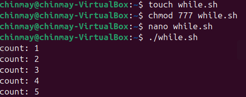
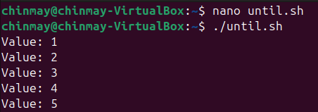
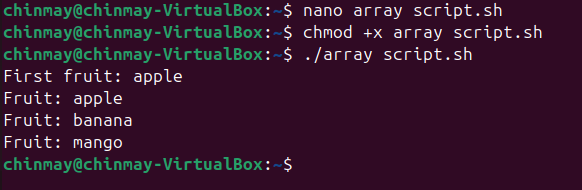

# LAB 6:- Learning Shell Scripting
### Shell scripting allows you to automate tasks in Linux/Unix by writing commands inside a file that the shell executes line by line.

# 1. What is shell script?
. A shell is a command line interpreter(e.g. bash, zsh, sh).

. A shell script is atext file with a series of commands.

. File usually has .sh extension,through not mandatory.

For Example:- hello.sh
```bash
 #!/bin/bash
 echo "Hello, World!"
```


# 2. Variables:-
Variables srore data (text,numbers,paths,etc).
## Defining Variables-
```bash
name="Chinmay"
age=17
```

## Accessing Variables:-
```bash
echo "My name is $name and I am $age years old."
```
OUTPUT:-
```bash
My name Chinmay and I am 17 years old.
```


## Environment Variables:-
```bash
echo $HOME  # home directory
echo #USER  # current user
echo $PWD   # presint working directory
```

# 3. User input:-
Read iput from user with ```read```.

```bash
#1/bin/bash
echo "Enter your favourite language:"
read lang
echo "you choose $lang"
```


# 4. Conditional Statements (If-else)
```bash
#!/bin/bash
num=10

if [ $num -gt 5]; then
   echo "Number ig greater than 5"
else
   echo "Number is less than or equal to 5"
```


Operators:-
. ``` -eq``` (equal)
. ``` -ne``` (not equal)
. ``` -gt``` (greater than)
. ``` -lt``` (less than)
. ``` -ge``` (greater than or equal)
. ``` -le``` (less or equal)

# 5. Loops:-
## For loop:
```bash
for i in 1 2 3 4 5
do
    echo "number: $i"

```


## Or use a range:
```bash
for i in {1..5}
do
    echo "Iteration $i"
done
```
.png>)


## While loop:
```bash
count=1
while[ $count -le 5]
do
   echo "Count: $count"
   ((count++))  # increment
done
```



## Until loop:
Runs until condition becomes true.
```bash
x=1
until [ $x -gt 5]
   echo "Value: $x"
((x++))
done
```



# 6. Functions:-
Encapsulate reusable code.
```bash
greet() {
    echo "Hello, $1"
}
greet chinmay
greet world
```
Output:
```bash
Hello, Chinmay
Hello, World
```


# 7. Cpmmand line arguments
Access arguments paases to script:
```bash
#!/bin/bash
echo "Script name: $0"
echo "First argument: $1"
echo "Second argument: $2"
echo "All arguents: $@"
echo "Number of arguments: $#"
```
Run:
```bash
./script.sh apple banana
```
Output:
```bash
Script name: ./script.sh
First argumnet: apple
Second argument: banana
All arguments: apple banana
Number of arguments:2
```
# 8. Arrays:-
```bash
fruits=("apple" "banana" "mango")
echo "First fruit: ${fruits[0]}"
for fruit in "${fruits[@]}"; do
    echo "Fruit: $ fruit"
done
```



# 9. Useful commands in scripts:-
.```date```-show current date/time

.```whoami```-show current user

.```ls```-list files

.```pwd```-print working directory

.```car```-read files contents

# 10. A practical exaple:-
Backup script(```backup.sh```)
```bash
#!/bin/bash
# Backup home directory to /tmp
backup_file="/tmp/home_backup_$(date +%Y%m%d%H%M%S).tar.gz"

tar -czf $backup_file $HOME

echo "Backup saved to $backup_file"
```
Run:
```bash
./backup.sh
```