# LAB 1 :- INSTALLING VIRTUAL STUDIO CODE AND LINUX
## WHAT IS LINUX ?
Linux is an open source operating system (OS) based on Unix. It runs on computers, servers, mobile phones and a wide range of other devices.

Since its invention in 1991, it has become 1 of the most widely used operating systems in the world, providing a free alternative to other operating systems that are proprietary, such as Microsoft Windows and macOS.

Linux was developed by Linus Torvalds to be a Unix-like alternative to Unix, 1 of the first operating systems ever built. It relies heavily on the Linux kernel for its functionality. In an OS, the kernel is a computer program that allows users to control the system's hardware and software. In addition to the kernel, the Linux OS uses various components, such as system libraries and space utilities, but they all rely on the kernel to communicate and receive commands from users.

## STEP 1 :- DOWNLOADING VIRTUAL BOX FILE
1. Go to the virtual box then select your operating system

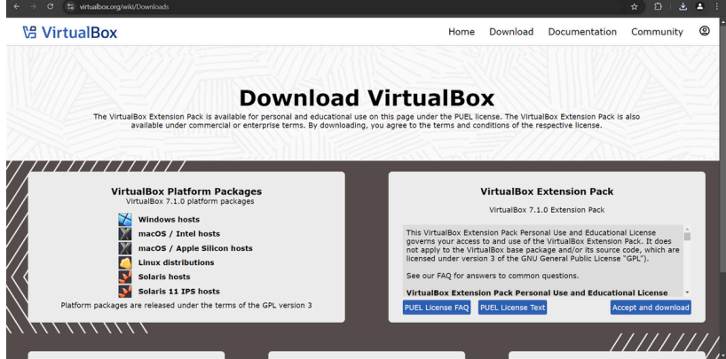

## STEP 2 :- INSTALLING VIRTUAL BOX
1. The begining 

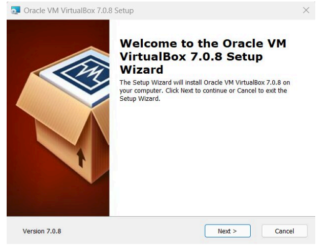

2. Select installation location

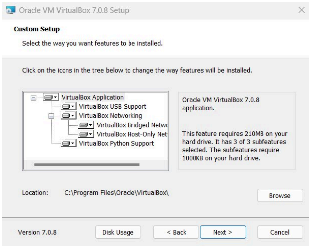

3. Ready to install

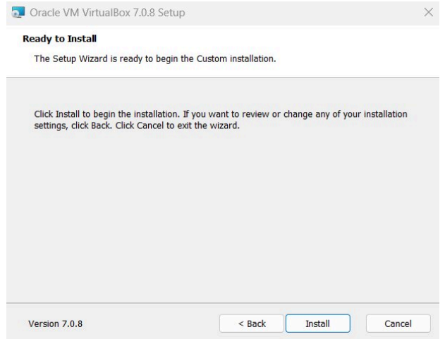

4. Installation complete

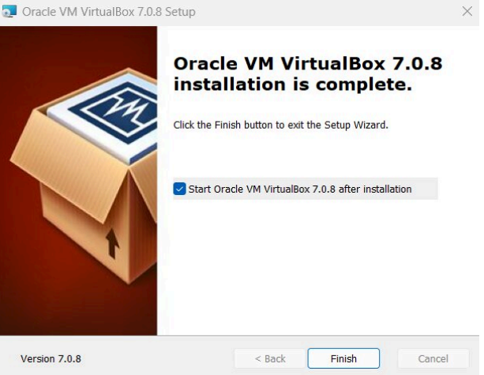

5. Opening virtual box

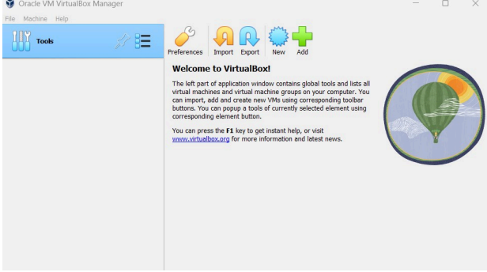

## STEP 3 :- INSTALLING LINUX USING VIRTUAL BOX
## 1. Naming virtual machine
- After installing virtual box, click new

- Write the name you want for your system

- Select type:Linux

- Select version:Ubuntu

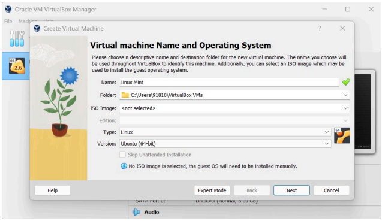

2. Select the amount of RAM

3. Hard disk setting
 
- Select hard disk setting
  
- Choose 'Create a virtual hard drive now',in order to make a virtual disk space.

- Select the amount of hard drive size.

- Now you are done with hardware settings.

4. Launching your system

- Choose the download linux ISo file:

- Click start to launch your system.

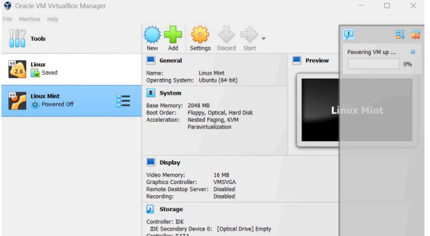

- Choose your ISO file from your computer.

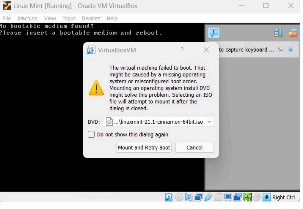

5. Installation

- Install linux

- Click install linux mint:

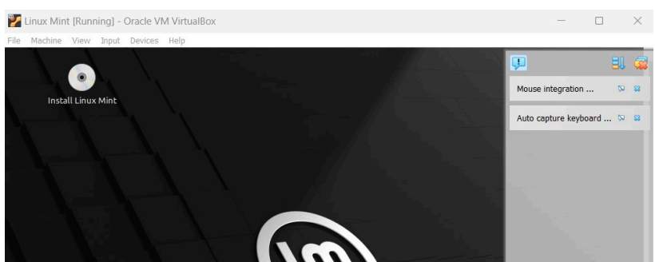

- Make your account:

- Enter your details as shown below.

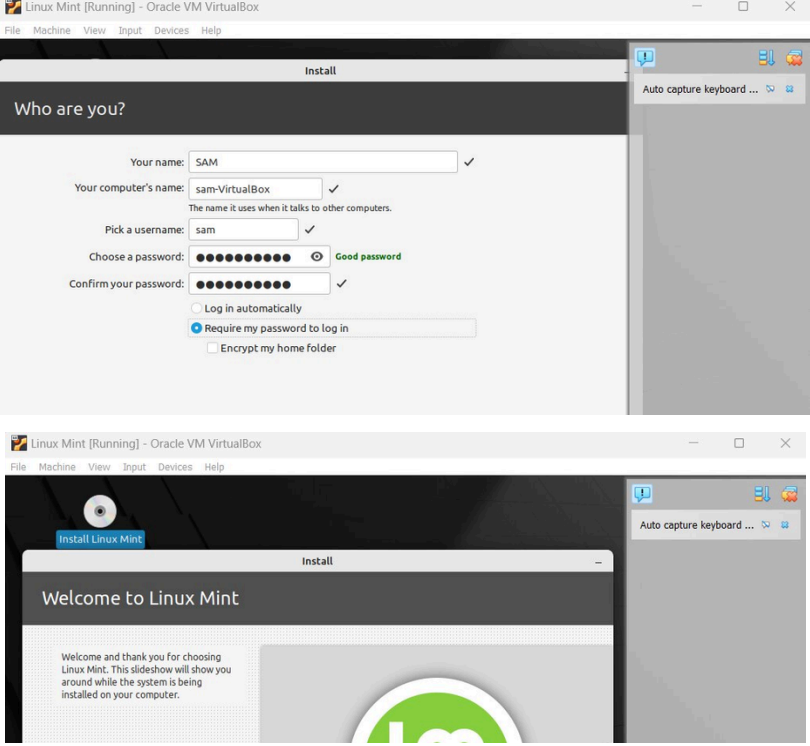

## CONGRATULATIONS YOU HAVE SUCCESSFULLY INSTALLED THE UBUNTU LINUX.

