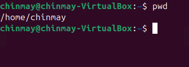
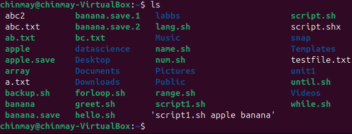
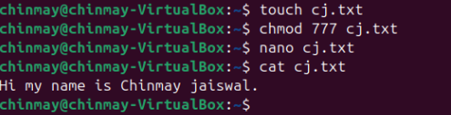
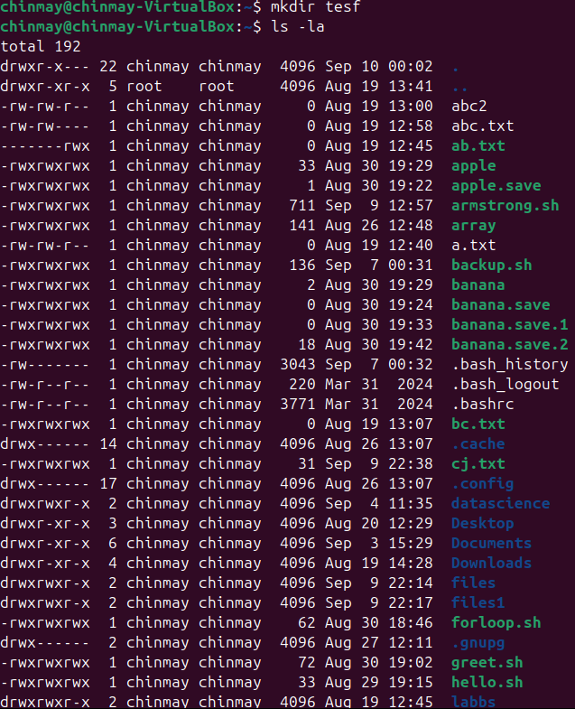
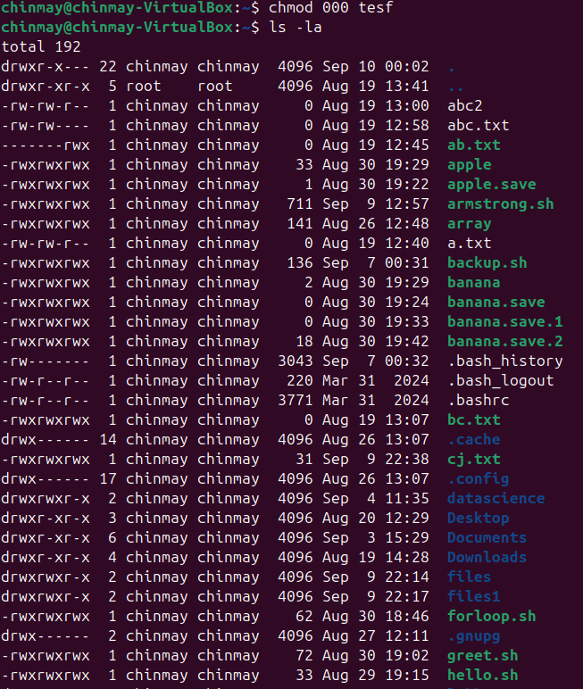
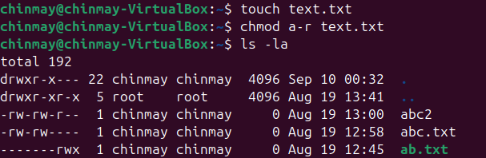
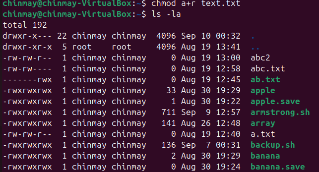

# 📌 We will be going thourgh basic linux commands.

## ✅ 1. Navigation Commands
## pwd – Print Working Directory
Shows the current location in the filesystem.

## 📌 Output example:-



# ls – List Directory Contents
The ls command is used to list files and directories in the current working directory.
flag-a list down all the file and folder including the one which are hidden
ls -l → Detailed list (permissions, size, date)
ls -a → Shows hidden files (those starting with .)
ls -la → Combined



# cd – Change Directory
Moves into a directory.

```bash
cd
```
Examples:

     cd Documents    #Go to Documents

         cd ..       # Go up one level

     cd /           # Go to root

     cd ~           # Go to home directory

     


# ✅ 2. File and Directory Management

mkdir – Make Directory

Creates a new folder.

```bash
mkdir new_folder
```

# touch – Create File

Creates an empty file

```bash
touch file.txt
```
# cp – Copy Files or Directories

```bash
cp source.txt destination.txt
```

# mv – Move or Rename Files

```bash
mv oldname.txt newname.txt
```
# rm – Remove Files

```bash
rm file.txt   # Delete file

rm -r folder_name   # Delete folder (recursively)
```

# ⚠️ Be careful! There is no undo.


# ✅ 3. File Viewing & Editing

cat – View File Contents

Displays content in terminal.

```bash
cat file.txt
```

# nano – Edit Files in Terminal

A basic terminal-based text editor.

```bash
nano file.txt
```
Use arrows to move

CTRL + O to save

CTRL + X to exit



# clear – Clears the Terminal

```bash
clear
```
Shortcut: CTRL + L

# ✅ 4. System Commands

echo – Print Text

Useful for debugging or scripting.

```bash
echo "Hello, World!"
```
whoami – Show Current User

```bash
whoami
```
# man – Manual for Any Command

```bash
man ls
```
Use q to quit the manual.

# ✅ 5. Searching and Finding

find – Locate Files

```bash
find . -name "*.txt"
```
## 🔍 Finds all .txt files in current folder and subfolders.

# grep – Search Inside Files

```bash
grep "hello" file.txt
```
space


## 🔍 Searches for the word hello inside file.txt .

# ✅ 6. Helpful Shortcuts

| Shortcut  | Action                      |
|-----------|-----------------------------|
| Tab       | Auto-complete files/folders |
| ⬆️ / ⬇️  | Browse command history      |
| CTRL + C  | Stop running command        |
| CTRL + L  | Clear screen                |


# ✅ 7. Bonus: Chaining Commands

## • Run multiple commands:

```bash
mkdir test && cd test && touch hello.txt
```
## • Run only if previous command succeeds: &&

## • Run regardless of success: ;

# 🐚 Shell Tutorial – File Permissions with chmod and chown

### 🔹 1. Understanding File Permissions in Linux

Each file/directory in Linux has:-

    •Owner → The user who created the file.

    •Group → A group of users who may share access.

    •Others → Everyone else.

## Permission Types

##  Run multiple commands:

     •r → Read (4 in numeric)
     •w → Write (2 in numeric)
     •x → Execute (1 in numeric)

## Permission Layout

Example from ls -l :
```bash
-rwxr-xr--
```
Breakdown:

   • → Regular file ( d = directory, l = symlink, etc.)

   • rwx → Owner has read, write, execute

   • r-x → Group has read, execute

   • r-- → Others have read only





## 🔹 2. chmod – Change File Permissions

### Syntax
```bash
chmod [options] mode filename
```
Modes can be set in numeric (octal) or symbolic form.

### (A) Numeric (Octal) Method

Each permission is represented as a number:


  • Read = 4

  • Write = 2

  • Execute = 1

Add them up:

  • 7 = rwx

  • 6 = rw5 = r-x

  • 4 = r--

  • 0 = ---


Example:

```bash
chmod 777 script.sh
```
Meaning:

 • Owner: 7 → rwx

 • Group: 7 → r-w-x

 • Others: 7 → r-w-x

## Image



## (B) Symbolic Method

Use u (user/owner), g (group), o (others), a (all). Operators:

• + → Add permission

• - → Remove permission

•  = → Assign exact permission

Modes can be set in numeric or symbolic form.




## (C) Recursive Changes

```bash
chmod -R 755 /mydir
```
• -R → applies changes recursively to all files/subdirectories.


## 🔹 3. chown – Change File Ownership

Syntax
```bash
chown [options] new_owner:new_group filename
```

Examples:
```bash
chown chinmay.txt # Change owner to user 'sameer'
chown chinmay:aryan.txt # Change owner to 'sameer' and group to 'dev'
chown chinmay:aryan file.txt # Change only group to 'dev'
chown -R chinmay :aryan /project # Recursive ownership change
```
## Practice Experiment on chown

🔹 1. Create a new user
```bash
sudo useradd -m newuser
```
 -m → creates a home directory /home/newuser .

## 🔹 2. Create a new group

 ```bash
 sudo groupadd newgroup
 ```
## 🔹 3. Add the user to the group

```bash
sudo usermod -aG newgroup newuser
```
-aG → append user to the supplementary group (doesn’t remove existing groups).

## 🔹 4. Create a file (as current user, e.g. root or your login user)

```bash
touch testfile.txt
```
Check ownership:

```bash
ls -l testfile.txt
```
Example:

```bash
-rw-rw-r--1 sameerbhardwaj sameerbhardwaj 0 Aug 20 18:52 testfile.txt
```
## 🔹 5. Assign ownership of the file to newuser and newgroup

```bash
sudo chown newuser:newgroup testfile.txt
```
## 🔹 6. Verify ownership

```bash
ls -l testfile.txt
```
