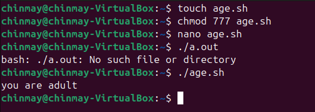

### 🔧understanding how existing scripts in repository work.

## 🔧script 1:-

```bash
#!/bin/bash - shebang
echo "hello, world!" - printing hello world

name="chinmay" - taking chinmay in variable name

age=17 - taking 17 in variable age

echo "My name is $name ansd I am $age year old." - printing name and age
```


## 🔧 script 2:-

```bash
#!/bin/bash -shebang
a="chinmay" -taking chinmay in the variable a

b=40 -taking 40 in the variable b

if [ $a="chinmay" ] && [ $b -gt 18 ]; then -checking conditions and

using an opreator and(&&)

echo " you are adult " - printing you are adult

fi

if [ $a=" aryan" ] && [ $b -lt 18 ]; then -checking conditions

and using an opreator and(&&)

echo "you are minor" - printing you are

minor

fi
```


## 🔧 Q1 what is the purpose of #!/bin/bash at the top of the script

```bash
Answer= the shebang line at the top of a script specifies the interpreter that should be used to the run the script.
```
## 🔧 Q2 how do you make a script executable?

```bash
Answer = 1. add the shebang at the top

2. give permission using the chmod command

3. run the code.
```