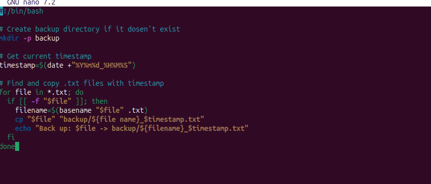
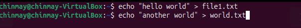

# 📌 BACKUP

## ✅1. backup.sh Script

Create a new file named backup.sh inside your project folder:-



## ✅ 2. Make Script Executable

Run the following command once:
```bash
chmod 777 backup.sh
```
## ✅ 3. Testing the script

## 1. Create some samples .txt files:



## 2. Run the script:
./backup.sh

## 3. Check the backup/folder:
ls backup/

# 🔧 LAB4– File & Backup Automation

## Objective

Automate the backup of  .txt  files into a  backup/  folder with timestamps in filenames.

# 🔧 Script Explanation

1.  mkdir -p backup
 
Creates a folder n".

🔹 2. Using at (One-time Scheduling) Run a script once at a specific time:

echo "/home/user/backup.sh" " amed  backup  if it does not exist.


