# LAB 0 :- INSTALLING VIRTUAL STUDIO CODE AND LINUX
## WHAT IS LINUX ?
Linux is an open source operating system (OS) based on Unix. It runs on computers, servers, mobile phones and a wide range of other devices.

Since its invention in 1991, it has become 1 of the most widely used operating systems in the world, providing a free alternative to other operating systems that are proprietary, such as Microsoft Windows and macOS.

Linux was developed by Linus Torvalds to be a Unix-like alternative to Unix, 1 of the first operating systems ever built. It relies heavily on the Linux kernel for its functionality. In an OS, the kernel is a computer program that allows users to control the system's hardware and software. In addition to the kernel, the Linux OS uses various components, such as system libraries and space utilities, but they all rely on the kernel to communicate and receive commands from users.

## STEP 1 :- DOWNLOADING VIRTUAL BOX FILE 
## 1. Go to the virtual box , then select your operating system

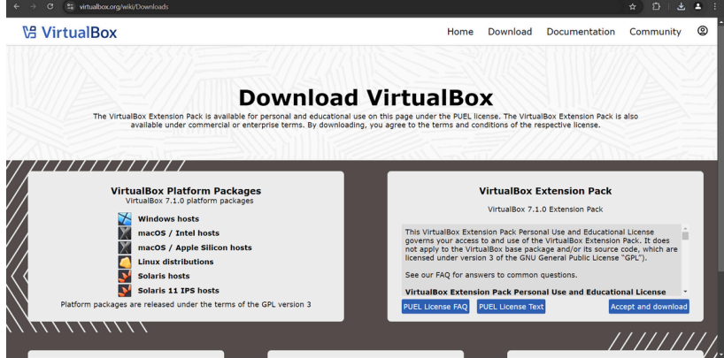

## STEP 2 :- INSTALLING VIRTUAL BOX

## 1. The begining 

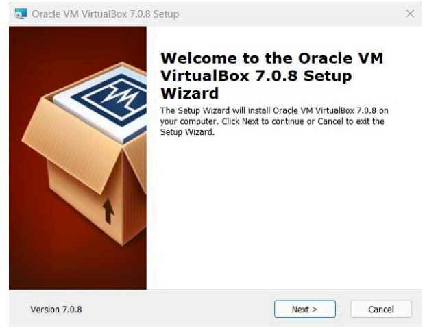

## 2. Select installation location

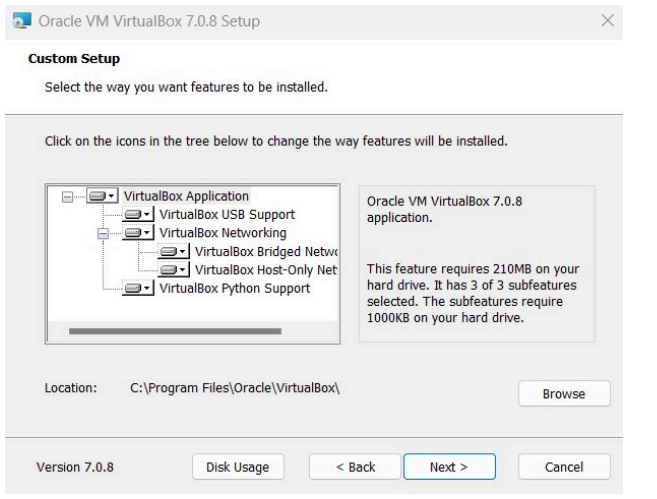

## 3. Ready to install

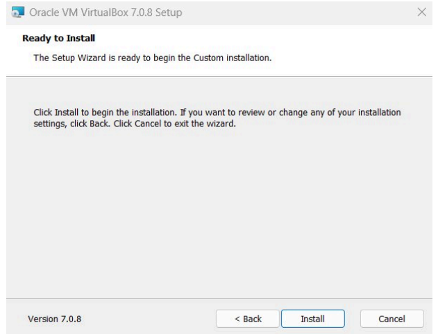

## 4. Installation complete

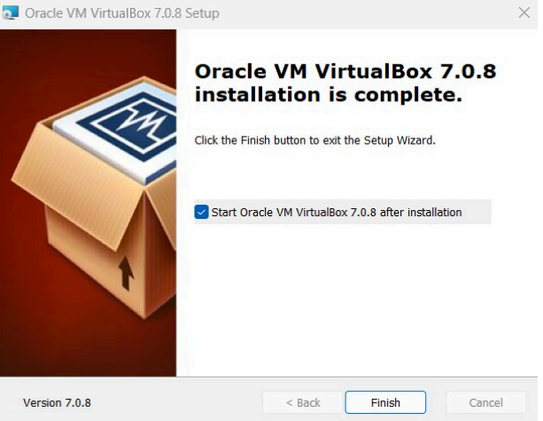

## 5. Opening virtual box

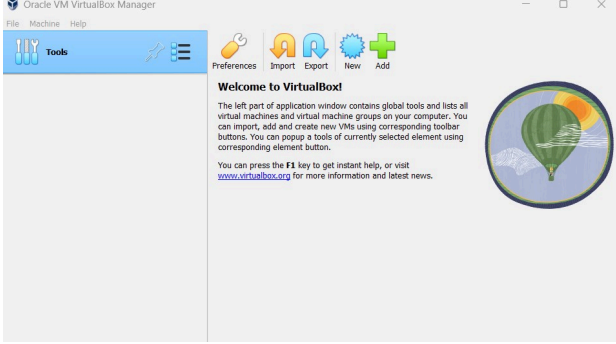

## STEP 3 :- INSTALLING LINUX USING VIRTUAL BOX
## 1. Naming virtual machine
- After installing virtual box, click new

- Write the name you want for your system

- Select type:Linux

- Select version:Ubuntu

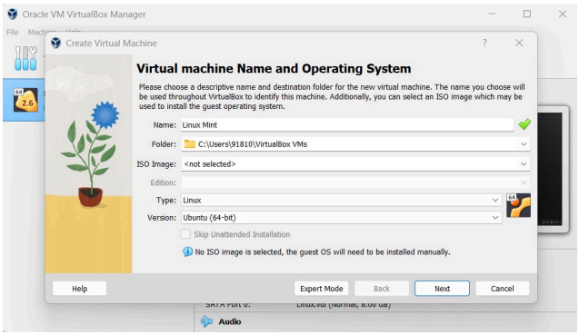

## 2. Select the amount of RAM

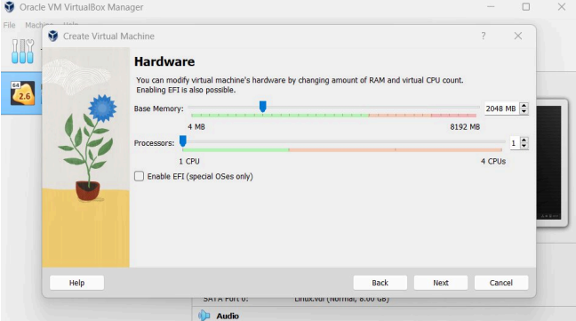

## 3. Hard disk setting
 
- Select hard disk setting
  
- Choose 'Create a virtual hard drive now',in order to make a virtual disk space.

- Select the amount of hard drive size.

- Now you are done with hardware settings.

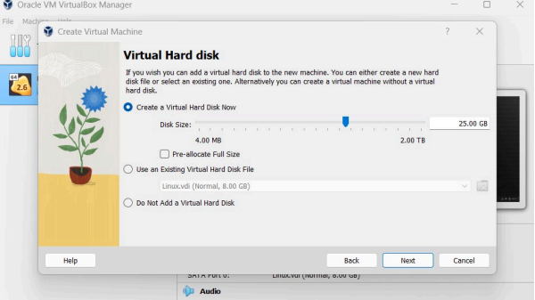

## 4. Launching your system

- Choose the download linux ISo file:

- Click start to launch your system.

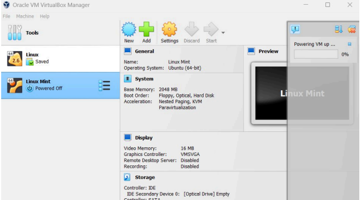

- Choose your ISO file from your computer.

## 5. Installation

- Install linux

- Click install linux mint:

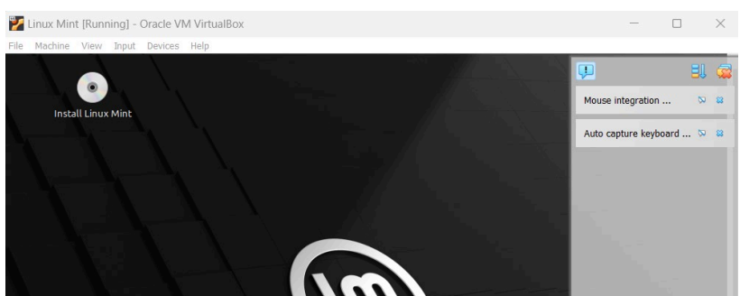

- Make your account:

- Enter your details as shown below.

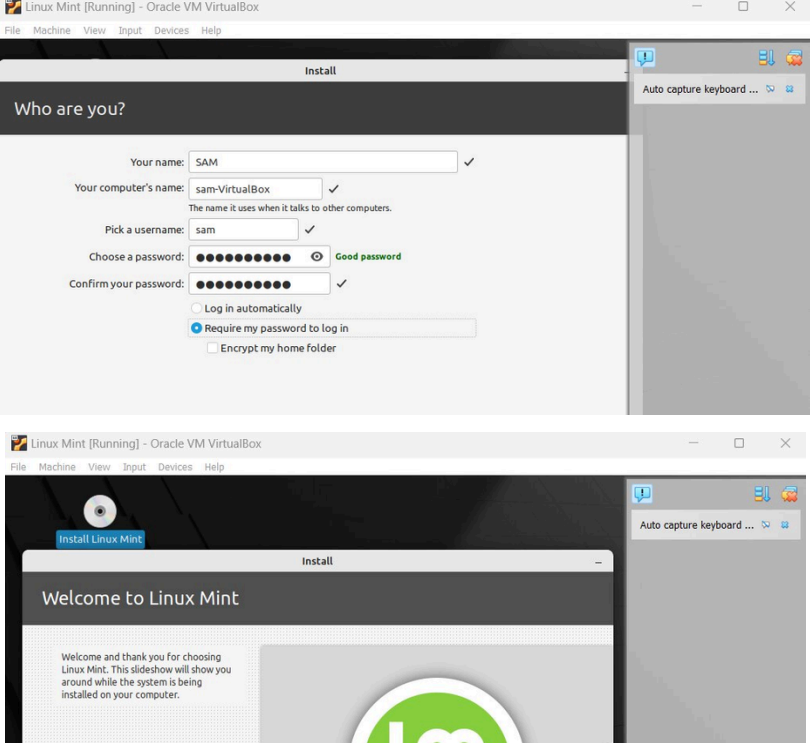

## CONGRATULATIONS YOU HAVE SUCCESSFULLY INSTALLED THE UBUNTU LINUX.

## Extra Questions:-
Q1. What are the two advantages of installing Ubuntu in VirtualBox?

Answer - Here are two key advantages of installing Ubuntu in VirtualBox:-

✅ Safe Testing Environment
Installing Ubuntu in VirtualBox creates a sandboxed virtual machine (VM), so you can experiment freely without affecting your main operating system. You can test applications, run potentially risky commands, or try different configurations, and if something breaks, you can simply reset the VM or start fresh.

✅ Easy Snapshot and Reversion
VirtualBox allows you to take snapshots of your Ubuntu installation at any point in time. If an update, configuration, or installation causes issues, you can instantly revert back to a previous stable state. This makes development, testing, and learning much safer and more convenient.

These advantages are especially useful for developers, students, or anyone wanting to explore Ubuntu without committing to a full installation on their hardware.

Q2. What are the two advantages of dual booting instead of using a VM?

Answer - Here are two advantages of dual booting Ubuntu instead of using a virtual machine (VM) like VirtualBox:-

✅ Full Hardware Performance
In a dual boot setup, Ubuntu runs directly on your computer's hardware, which means you get full access to the CPU, RAM, GPU, and storage without the overhead that comes from virtualization. This is especially important for performance-intensive tasks like gaming, video editing, or compiling large code projects, where VMs tend to run slower.

✅ Better Resource Utilization
Since there’s no virtualization layer in dual booting, the OS can use all available system resources (like all cores of the CPU and the full RAM). In contrast, a VM divides resources between the host OS and the guest OS, which limits performance and sometimes causes resource contention, especially if your system doesn’t have a lot of RAM or processing power.

These benefits make dual booting a preferred choice when performance matters and when you plan to use Ubuntu for heavy-duty tasks.